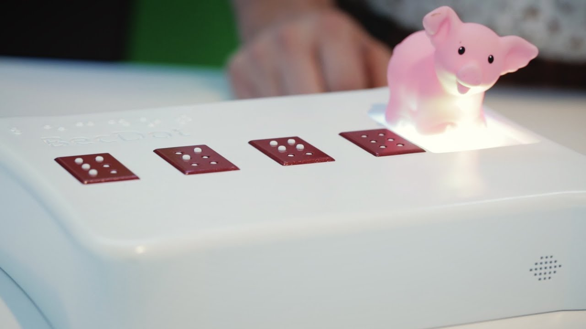

# 18-500 Team D6 Spring 2018

## What is Mobraille?
Mobraille is an object-to-Braille device that is scoped to classify
three different toys and articulate their names in Braille. Mobraille will
enable blind children to begin to see the world.

## Why Mobraille?

Students with vision impairment often struggle in educational settings as most
devices used to teach the blind are prohibitively expensive. Furthermore,
braille keyboards and refreshable displays are limited to the cyber world.
Mobraille extends learning opportunities to the physical world.

## Our inspiration

BecDot is an electromechanical educational toy that uses NFC tags to identify objects
and then articulate Braille characters.

## Current tasks
* Image data set collection with consistent white backdrop and lighting
* Implementation of bounding box of toy (image segmentation)
* Color moments feature extraction implementation
* Histogram of gradients feature extraction implementation
* PCB Design Iteration (2)

## Blog Posts

- [March 29](pages/update3.md)
- [March 22](pages/update2.md)
- [March 5](pages/update1.md)

## Meet the Team
- [Team Bios](pages/team.md)

---

