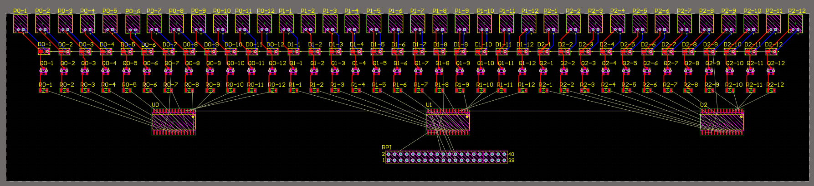

# March 29 Weekly Update

__Software Team (Tara & Omkar)__
  - Omkar tried to reduce noise in image data collection scheme, using different white backgrounds for the box
  - Tara restructured image data collection pipeline by painting the inside of our data collection box white, changing the orientation of the LEDs, mounting a stand for the RPi camera
  - Tara collected a full new dataset — 90 images of 3 classes
  - Tara implemented a basic version of PCA that is currently too slow
  - Omkar finished a rudimentary image segmentation algorithm to isolate the object from the white background

__Hardware Team (Chris & Omkar)__
  - We selected surface mount components and found resistor and mosfet array packaging to reduce the number of total components.
  - We finished our PCB schematic.
  - We met with Artur to review schematic and agreed that it was time to move on to arrangement and routing.
  - We began routing. Current state of routing is shown below:
  

Pictured are the 36 solenoid connectors and switching circuits, the 3 port expander chips, and the RPi GPIO connector. 

This coming week we will:
  - Finish the PCB routing tomorrow. A Molex power connector needs to be added.
  - Review the routing with Artur.
  - Submit a PCB order.
  - Breadboard a prototype 6-dot, 1-character circuit to interface with our basic pipeline. This is for our midpoint demo on Monday.
  - When the through-hole port expander chips arrive, begin interfacing with them on a breadboard.

[Back](../index.md)
